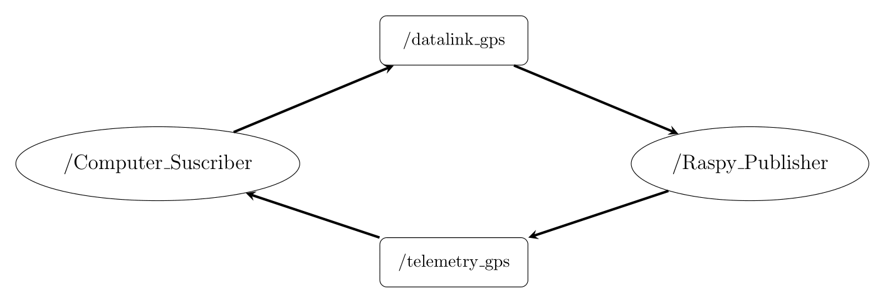

# Ros_Paparazzi

`ros_paparazzi` is a ROS 2 package that includes the functionalities to communicate with the Paparazzi autopilot system.

## Repository Structure

This repository contains two packages:

- **ros_paparazzi_core**: Contains the main Python nodes responsible for subscribing and publishing data to/from the Paparazzi autopilot system.
- **ros_paparazzi_interfaces**: Defines the custom ROS 2 message types used by `ros_paparazzi_core` (currently just one).

## Requirements

- ROS 2 Humble


## Setup Instructions

Clone the repository into your ROS 2 workspace:

```bash
cd {ROS_WORKSPACE}/src
git clone {REPOSITORY}
```

For an easy install, a `./install.sh` is included (you can also use colcon to build the package).


## Running the Nodes

At the moment there are two nodes that can be runned.



For lauching the node in the Raspberry, run (inside a docker):

```
ros2 run ros_paparazzi_core raspy
```

And in your computer, run:

```
ros2 run ros_paparazzi_core computer
```

If you have everything connected, you should see the waypoint defined in the `data.txt` move


